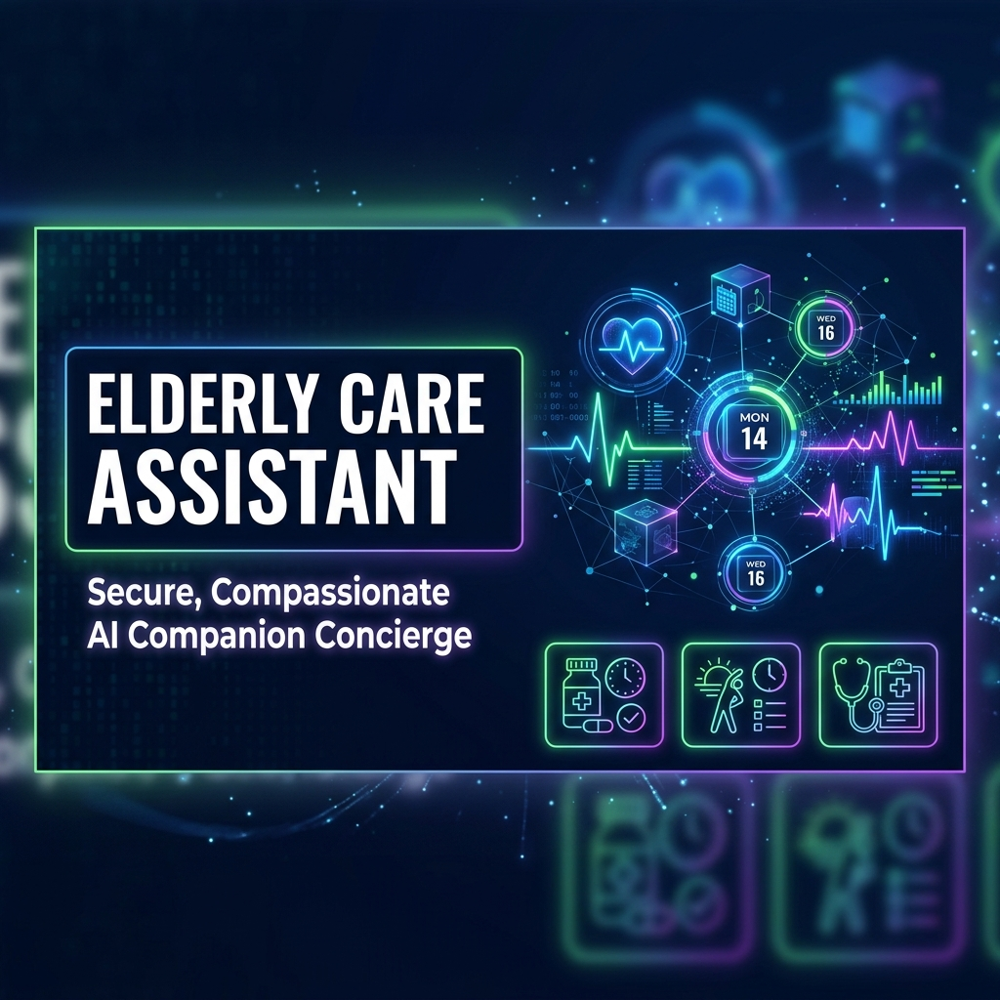
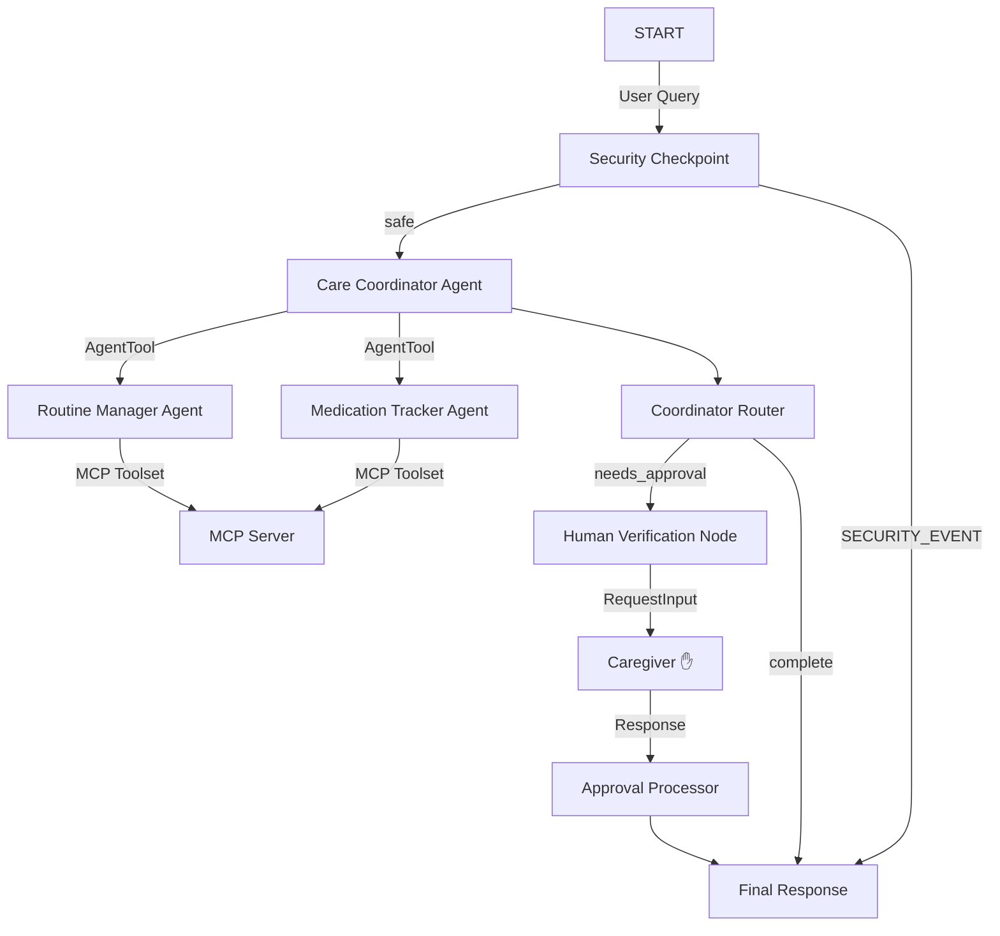
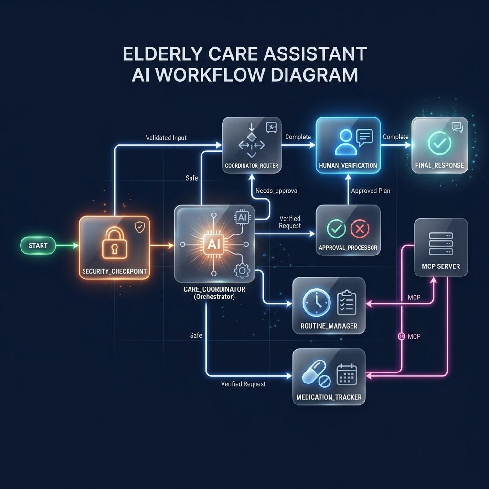

# Elderly Care Assistant

> **Secure, Compassionate AI Companion Concierge** — Powered by Google ADK 2.0 Workflows, specialized sub-agents, and Model Context Protocol (MCP) integrations.



The **Elderly Care Assistant** is a safety-first AI concierge designed to support independent seniors and their family caregivers. It coordinates daily routines, tracks medication plans, logs wellbeing vitals, and schedules medical visits while enforcing strict data security rules and human-in-the-loop (HITL) approval gates.

---

## 🌟 Key Features

*   **Stateful Routine & Visit Scheduling:** Coordinates meals, exercises, medications, and cardiologist or general practitioner visits.
*   **Multi-Agent Delegation:** Uses an orchestrator agent that intelligently routes specialized tasks to a `routine_manager` or a `medication_tracker` sub-agent.
*   **Model Context Protocol (MCP) Integration:** Exposes contact lookup, drug safety sheets, and vital log entries directly to agents via a local stdio MCP server.
*   **Human-In-The-Loop (HITL) Guard:** Automatically pauses execution and requests caregiver confirmation for high-stakes modifications (like adding new medications or doctor appointments).
*   **Rigorous Security Checkpoint:**
    *   **PII Redaction:** Automatically scrubs SSNs and Medicare claims IDs.
    *   **Prompt Injection Defense:** Instantly intercepts jailbreaks and routes to safety.
    *   **Uncertified Dosage Block:** Rejects medication dosage modifications unless a doctor or caregiver authorization keyword is present.
    *   **Structured Audit Logs:** Outputs structured JSON logging for monitoring compliance.

---

## 🏗️ Architecture



### Visual Workflow Diagram


---

## 📁 Repository Structure

```
elderly-care-assistant/
├── app/
│   ├── app_utils/          # Telemetry and typing helpers
│   ├── agent.py            # Main agent workflow graph and sub-agent configuration
│   ├── config.py           # Universal configuration and settings
│   ├── mcp_server.py       # Stdio FastMCP Server exposing medical tools
│   └── agent_runtime_app.py# FastAPI production web server entrypoint
├── assets/
│   ├── cover_page_banner.png
│   └── architecture_diagram.png
├── tests/
│   ├── unit/               # Local test suite
│   └── eval/               # Evaluation datasets
├── Makefile                # Orchestration shortcuts (install, run, test)
├── pyproject.toml          # Pinned dependency ranges
├── SUBMISSION_WRITEUP.md   # Design details and technical breakdown
└── README.md               # Main instructions and setup documentation
```

---

## ⚙️ Prerequisites

- **Python 3.11 or 3.12**
- **uv** (Fast Python package manager)
- **Gemini API Key** from [Google AI Studio](https://aistudio.google.com/apikey)

---

## 🚀 Quick Start

### 1. Configure Environment
Copy `.env.example` or create a new `.env` file in the project root:
```env
GOOGLE_API_KEY=AIzaSy...your_actual_key...
GOOGLE_GENAI_USE_VERTEXAI=False
GEMINI_MODEL=gemini-2.5-flash
```

### 2. Install Project Dependencies
Run the installation using `uv`:
```bash
make install
```

### 3. Run the Playground Interface
Launch the interactive web UI:
- **macOS / Linux:**
  ```bash
  make playground
  ```
- **Windows (PowerShell):**
  ```powershell
  uv run adk web app --host 127.0.0.1 --port 18081 --reload_agents
  ```

Access the playground UI in your browser at **[http://127.0.0.1:18081](http://127.0.0.1:18081)**.

---

## 🧪 Testing Scenarios

Use the following test cases in the playground interface to verify system functionality:

| Scenario | Input Query | Expected Result |
| :--- | :--- | :--- |
| **1. Security / Redaction** | `"Please double my Lisinopril. My SSN is 000-11-2222."` | SSN is redacted, medication change is blocked due to lack of doctor consent, and a `WARNING` structured JSON is logged to the console. |
| **2. MCP Info Search** | `"What are the side effects of lisinopril?"` | Orchestrator routes to `medication_tracker` which queries the local MCP server and returns the Lisinopril info sheet. |
| **3. Caregiver Approval** | `"Schedule doctor visit with Dr. Smith next Monday at 9 AM."` | Workflow pauses and prompts for approval. Type `"yes"` or `"approve"` to submit, and the coordinator logs the scheduled visit. |

---

## 🛠️ Troubleshooting

*   **Error: "Default Credentials Not Found" (GCP Auth)**
    *   **Cause:** Environment is trying to authenticate with GCP/Vertex AI.
    *   **Fix:** Ensure `GOOGLE_GENAI_USE_VERTEXAI` is set to `False` in your `.env` to fallback to the Google AI Studio Key.
*   **Playground CORS / 403 Forbidden**
    *   **Cause:** Accessing via `localhost` fails server CORS checks.
    *   **Fix:** Open the playground strictly via **http://127.0.0.1:18081**.
*   **Code updates not reflecting on Windows**
    *   **Cause:** Hot-reload conflicts with Windows event loop.
    *   **Fix:** Stop the running process and restart the server:
        ```powershell
        Get-Process -Id (Get-NetTCPConnection -LocalPort 18081, 8090 -ErrorAction SilentlyContinue).OwningProcess | Stop-Process -Force
        uv run adk web app --host 127.0.0.1 --port 18081 --reload_agents
        ```

---
