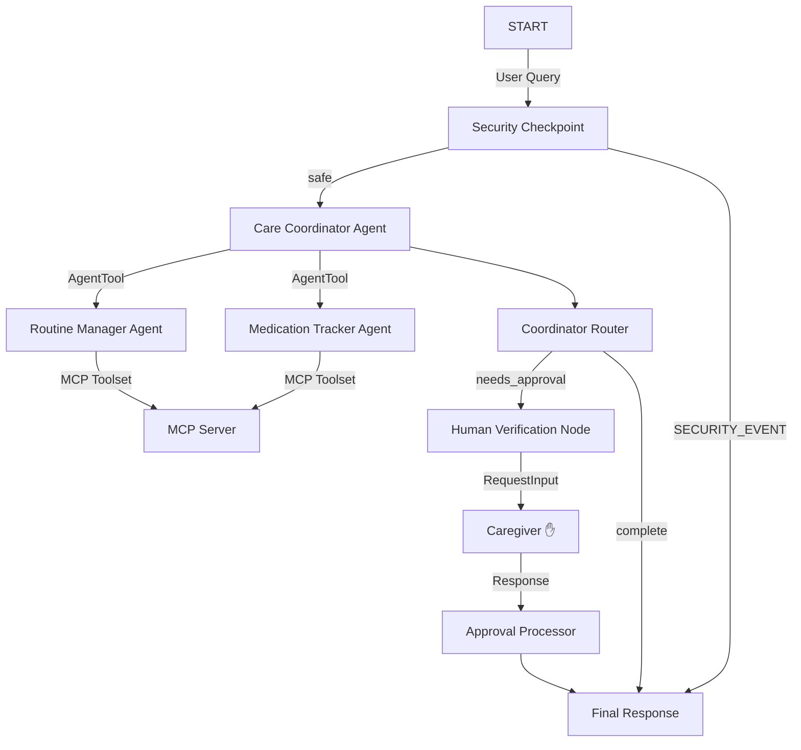

# ADK Submission Writeup: Elderly Care Assistant

## Problem Statement

As the global population ages, millions of seniors live independently or under the care of family members who juggle caregiving with professional lives. Senior care requires tracking daily routines, managing complex medication schedules, logging medical events, and coordinating doctor visits. Mismanaged routines or unverified medical additions can lead to adverse health outcomes. 

The **Elderly Care Assistant** solves this by providing a conversational companion for seniors and caregivers. It acts as a safety-first concierge that coordinates routines, schedules doctor appointments, and logs wellness alerts while keeping human caregivers in the loop for high-risk actions.

## Solution Architecture

The solution is built using Google ADK 2.0 Workflows. It utilizes a centralized coordinator agent that delegates tasks to specialized sub-agents and integrates with a local Model Context Protocol (MCP) server.

- **[app/agent.py](file:///d:/adk-workspace/elderly-care-assistant/app/agent.py)** contains the state schema, orchestrator agent, sub-agents, workflow nodes, and the compiled graph.
- **[app/mcp_server.py](file:///d:/adk-workspace/elderly-care-assistant/app/mcp_server.py)** contains the MCP server and its tool definitions.

## Concepts Used

1. **ADK 2.0 Workflow Graph API:** Operates as a stateful, event-driven graph consisting of `FunctionNode`s and `Edge` routing.
2. **Multi-Agent Orchestration (`AgentTool`):** The orchestrator (`care_coordinator`) delegates specialized queries to `routine_manager` and `medication_tracker` using `AgentTool` functional calling.
3. **Inter-Node State Sharing (`ctx.state`):** A shared Pydantic `ElderlyCareState` tracking routines, medications, appointments, and alerts across all agents and nodes.
4. **Model Context Protocol (`McpToolset`):** A local MCP server running via standard stdio transport, giving agents direct, scoped access to external resources (medical contacts, medication data sheets, health logs).
5. **Human-in-the-loop (`RequestInput`):** Halts workflow execution to request caregiver consent when scheduling new medical appointments or altering schedules.
6. **Agents CLI Scaffolding:** Initialized using `agents-cli scaffold` and built locally using pinned, reproducible package versions in `pyproject.toml`.

## Security Design

Elderly care systems deal with highly sensitive medical and personal information. The assistant implements the following safety guards at the **Security Checkpoint** node:
- **PII Scrubbing:** Regular expressions automatically detect and redact Social Security Numbers (SSNs) and Medicare claims IDs, replacing them with generic tags in the logs and context.
- **Prompt Injection Defense:** A keyword scanner flags jailbreak/instruction-override requests, immediately setting the route to `SECURITY_EVENT` and bypassing LLM processing.
- **Unauthorized Medication Modification Block:** Any query requesting dosage changes or stops is immediately blocked unless a caregiver or physician reference is found in the input query.
- **Structured Audit Logging:** Every transaction generates a structured JSON audit log specifying checks, redact status, and severity (`INFO`, `WARNING`, `CRITICAL`) for administrative monitoring.

## MCP Server Design

The system runs a local python-mcp-sdk server (`app/mcp_server.py`) exposing the following tools:
- **`get_medical_contacts(role)`**: Scopes and retrieves contact details for doctors, emergency caregivers, or pharmacies.
- **`search_medication_info(medication_name)`**: Fetches instructions, precautions, and side effects for common drugs to ensure informational safety.
- **`record_health_log(log_type, value, notes)`**: Logs vitals (heart rate, blood pressure, glucose levels) directly into caregiver wellness records.

## HITL Flow

To ensure patient safety, critical operations (such as scheduling doctor visits or changing schedules) cannot be completed autonomously by the AI coordinator. 
1. When the `care_coordinator` identifies a scheduling request, it sets `verification_required = True` in `ctx.state`.
2. The `coordinator_router` routes execution to `human_verification`.
3. The `human_verification` node yields `RequestInput`, halting execution and prompting the caregiver in the playground UI.
4. When the caregiver submits `"yes"`, `approval_processor` clears the lock, logs the action as verified, and updates the state.

## Demo Walkthrough

1. **Security / Redaction check:** Send `"Double my Lisinopril. My SSN is 000-11-2222."`
   - *Result:* SSN is redacted, the query is blocked due to lack of doctor verification, and a `WARNING` is printed in the audit logs.
2. **Medication / MCP check:** Send `"What are the side effects of lisinopril?"`
   - *Result:* Handled by `medication_tracker`, which retrieves database details via MCP and prints side effects (cough, dizziness).
3. **HITL appointment check:** Send `"Schedule doctor visit with Dr. Smith next Monday at 9 AM."`
   - *Result:* System pauses, prompts caregiver for confirmation. Type `"yes"` to approve. The system schedules the appointment and returns the success confirmation.

## Impact / Value Statement

The Elderly Care Assistant bridges the gap between seniors, caregivers, and medical systems. By delegating routines to specialized sub-agents, protecting medical safety through MCP resources, and requiring human caregiver approval for high-risk actions, it provides a safe, scalable, and empathetic care concierge that reduces caregiver burnout and improves senior independence.
